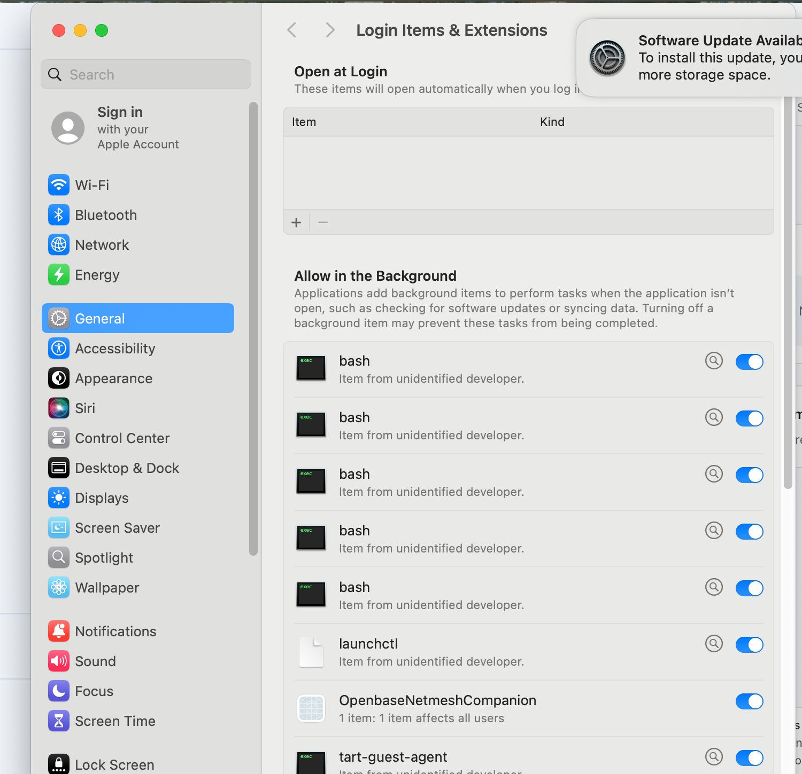
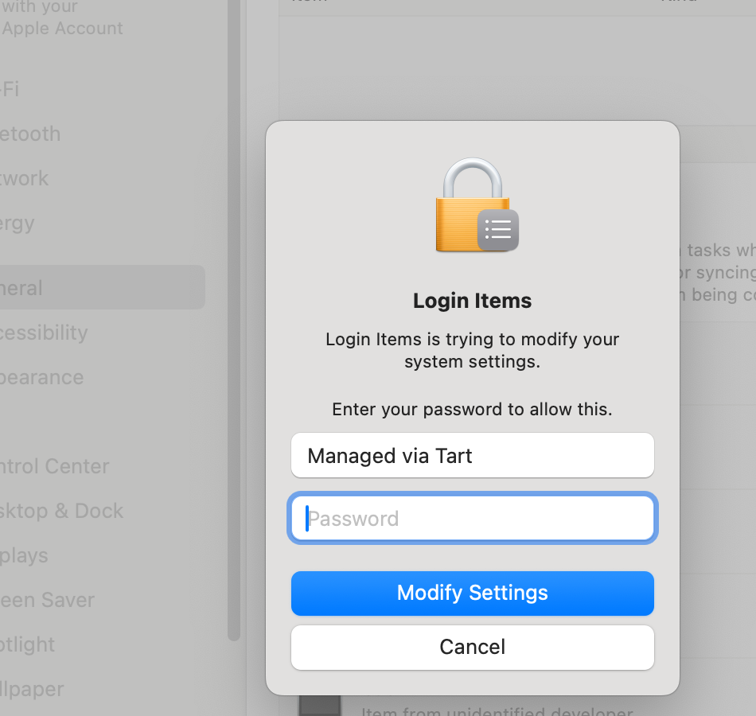
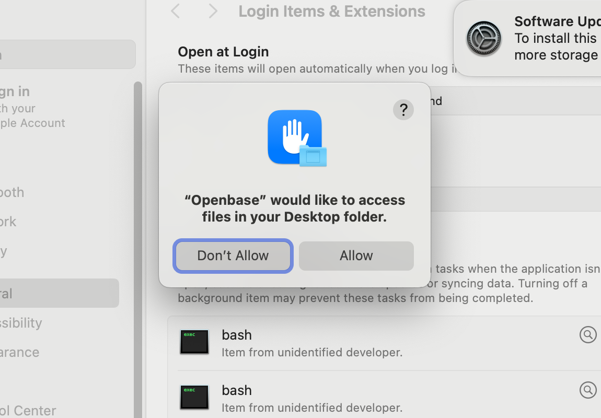

# Non-developer macOS DMG field-test runbook

This is the signed-DMG track for proving the complete path a non-developer uses: install Openbase in a clean Tart VM, finish all nine onboarding steps, pair the physical field-test iPhone, hear a dispatcher answer, and launch a real Super Agent. Use the root `field-testing` skill as the authoritative policy layer. Never use a developer's normal Openbase account, normal mobile app, or live macOS installation.

## Pass criteria

The run passes only when all of these are true:

- A signed and notarized channel DMG was installed into `/Applications` on a clean SIP-enabled macOS VM.
- Browser OAuth used the intended origin. For staging, the origin is exactly `app-staging.openbase.cloud`; a production origin is a hard stop.
- The generated CLI environment persists `OPENBASE_CODER_CLI_WEB_BACKEND_URL` with the same origin.
- The phone and VM are connected through Openbase VPN or Openbase Direct, privately paired, and the local backend is healthy.
- A question spoken acoustically to the physical iPhone receives an audible dispatcher answer in the configured dispatcher voice.
- `~/.openbase/logs/livekit-agent.log` contains a matching `voice_turn_result` with `status=completed` and `backend_auth_failure=False`.
- The stretch gate starts a non-dispatcher Super Agent in a new folder, the agent performs the briefing's real task, and its unsolicited introduction is heard. The spoken prompt must not ask the agent to introduce itself.

## 1. Front-load the only human actions

Before touching the VM, ask the user to unlock the physical iPhone, set Auto-Lock to Never, keep it beside the Mac's speakers, and be ready for one or two iOS device-passcode prompts for the VPN configuration and Mac trust. The agent drives every Tart/VM action, including the VM's own admin-password sheets. The agent never learns or enters the iPhone passcode.

Use only the field-test mobile variant, such as `com.openbase.coder.field-test`. Never launch or automate `com.openbase.coder`, because doing so can replace the user's normal VPN state.

## 2. Start a clean, usable VM

Openbase VPN requires a SIP-enabled guest. Use the maintained SIP-on field-test source or a vanilla macOS IPSW-derived source; do not use a SIP-disabled CI image for the VPN portion.

Start the VM at a large resolution so the complete onboarding and System Settings panes fit without brittle resizing or scroll workarounds:

```bash
./install-tests/electron-macos/manual-vm.sh \
  --source <sip-enabled-source> \
  --name <run-name> \
  --display 1920x1200pt
```

For an existing stopped VM, set the display before booting it again:

```bash
tart set <run-name> --display 1920x1200pt --no-display-refit
```

Tart's synthetic scroll, Page Down, and End forwarding is unreliable. A properly sized display is the supported solution; do not rely on meticulous window-edge dragging as part of the test procedure.

## 3. Install the real channel DMG

Inside the VM, open `https://openbase.cloud/downloads?staging=true` for staging or `https://openbase.cloud/downloads` for production, use the page's normal download control, open the DMG, drag Openbase to Applications, and open it through Gatekeeper. A staging-only run must never switch to or deploy production.

If Tart input prevents testing the marketing page, record that surface as untested and use the VM's built-in `curl -fL` over the documented one-line SSH path to place the exact channel DMG in `~/Downloads`; then resume Finder, Gatekeeper, Applications, and onboarding normally. Do not install extra download tools into the clean VM.

Keep the DMG in `~/Downloads`, not `/tmp`; macOS may clear `/tmp` across a VM reboot. When replacing an artifact during a staging retry, mount and verify the new DMG before moving the installed app, keep the previous app as a recoverable backup, and let Openbase reconcile its registered helper before removing that backup. A registered macOS background helper can continue resolving through the moved bundle until replacement finishes.

Verify the installed app is running from `/Applications` and is not app-translocated. Record its version, signature/notarization result, channel, and bundled CLI version in the field-test log.

## 4. Prepare Safari control before OAuth

Release Electron builds fuse off CDP. Start Safari control before clicking the onboarding login action so the OAuth page opens in the Safari instance that is already under semantic control:

```bash
./install-tests/electron-macos/guest-automate.sh enable-safaridriver <run-name>
./install-tests/electron-macos/guest-automate.sh safari-tunnel <run-name> 4444
node install-tests/electron-macos/driver/host-drive.mjs \
  --wd http://127.0.0.1:4444 goto "https://example.com"
```

Leave the tunnel running. Return to Openbase, click its login action, then use the WebDriver endpoint to inspect and fill the OAuth form. Starting the tunnel only after OAuth has opened is unreliable and can leave Safari outside computer control.

Verify the address-bar origin before entering credentials. Pass secrets through standard input to the semantic `fill` command, never as command-line arguments. Extract only the specific credential needed from secure storage; never source an entire environment file.

## 5. Tart text-entry rule

Do not paste credentials into Tart. Host Command-V may time out and insert only a literal `v`; punctuation and shifted characters may also be corrupted.

Use Safari WebDriver for browser fields. If a release UI field has no semantic endpoint and Tart typing is the only available path, select all or clear the field and keystroke the entire value again. Inspect the complete field before submitting. Never append characters to repair a malformed value. Generate long alphanumeric-only field-test passwords with no punctuation.

## 6. Complete all nine onboarding steps

Drive Overview → Prerequisites → Setup → Agent sign-in → Voice → Sign in → Phone → Pairing → Verify.

- Install the bundled CLI at Prerequisites.
- Run Setup and confirm the backend answers on `127.0.0.1:7999`.
- Choose Openbase Cloud for coding agents.
- Choose `openbase-cloud` audio unless the test matrix explicitly selects another real provider.
- Verify the cloud origin before sign-in and verify it persisted afterward.
- A signed non-developer build must offer only Openbase VPN and Openbase Direct. Seeing a standalone Tailscale option is a release defect.

Before pairing, verify the backend is truly ready:

```bash
curl -fsS http://127.0.0.1:7999/api/health/
lsof -nP -iTCP -sTCP:LISTEN | grep -E ':(7999|18080)'
```

## 7. Approve Openbase VPN in System Settings

Selecting Openbase VPN installs the signed `OpenbaseNetmesh` background item. Open System Settings → General → Login Items & Extensions, enable the Openbase Netmesh companion under Allow in the Background, enter the disposable VM's administrator password in the authorization sheet, and click Modify Settings.





Wait for the VM to join the intended Openbase network and confirm direct reachability to the phone. If repeated polling creates duplicate companion processes or `Address already in use`, record the failure; do not normalize a relaunch race as expected setup behavior.

Record the embedded Netmesh app build numbers so a stale prebuilt is visible in the field-test evidence:

```bash
/usr/libexec/PlistBuddy -c 'Print :CFBundleVersion' \
  /Applications/Openbase.app/Contents/Resources/OpenbaseNetmeshCompanion.app/Contents/Info.plist
/usr/libexec/PlistBuddy -c 'Print :CFBundleVersion' \
  /Applications/Openbase.app/Contents/Resources/OpenbaseNetmesh.app/Contents/Info.plist
```

For a staging DMG, confirm both apps came from the staging prebuilt channel and meet the release's minimum build. A staging package that silently fetches the stable-channel prebuilt is a release defect even if code signing succeeds; the staging build and publish paths must remain channel-local.

When testing an app upgrade, launch the replacement app and compare `netmesh-ctl version` with the embedded companion build before rebooting. The already-onboarded desktop must reconcile the registered privileged helper at launch; if the old helper remains active, record a release defect and do not use `tailnet set-provider` to make the reboot gate pass.

After the first successful connection, reboot the disposable VM once and verify Openbase VPN resumes without rerunning setup or `tailnet set-provider`. Pass only when the Netmesh status command returns promptly, the same private identity is present, and local LiveKit is listening again. A configured provider with an empty status response or a crash-loop reporting `LIVEKIT_NODE_IP is required` is a release defect.

## 8. Link, pair, and select the correct backend

Use the field-test iPhone app to link the account, accept its VPN configuration with the user-entered passcode, pair privately, and select this VM in the per-purpose backend device picker. Do not assume a successful pair proves the backend is running; retain the health checks from the previous step.

## 9. Acoustic dispatcher smoke

Speaker mode is a hard precondition. Connect the call, explicitly enable speaker, and verify the speaker control is visibly active. A tap alone is not proof. Do not emit any host speech until speaker state is proven.

In a noisy room, keep the phone muted while preparing. Immediately before playback, verify speaker mode again and tap Unmute. Immediately after the complete stimulus finishes, tap Mute.

Use Cartesia, not a macOS system voice, for the host stimulus. Extract only its API key from `~/Developer/.env` and pass it to the probe for that command:

```bash
CARTESIA_API_KEY="$(awk -F= '$1 == "CARTESIA_API_KEY" {sub(/^[^=]*=/, ""); print; exit}' ~/Developer/.env)" \
  .agents/skills/field-testing/scripts/acoustic-probe.py \
  "What is seven times six?" --stt mlx --seconds 25
```

Set and verify host output volume before playback. Confirm the physical phone audibly speaks the correct answer in the dispatcher's configured voice. Then corroborate the turn with a narrowly bounded log query:

```bash
tail -n 500 ~/.openbase/logs/livekit-agent.log |
  grep 'voice_turn_result' | tail -n 10
```

The matching line must show `status=completed` and `backend_auth_failure=False`. Logs do not replace listening.

## 10. Fresh Desktop-permission Super Agent gate

Create a new folder on the VM Desktop with a short `briefing.md` that asks for one exact file and exact content. Reset Desktop-folder TCC only on a disposable VM when the run specifically needs to prove the first-use permission path.

Speak only: “Start a coding session in the Desktop folder <folder name> and follow the briefing.” Do not ask the agent to introduce itself.

The first Desktop access should produce the product's spoken blocked-turn hint and this macOS prompt. Click Allow yourself in the Tart window:



Pass only when all three layers agree:

1. A non-dispatcher row appears in the Super Agents state database.
2. The requested file exists in the requested folder with exact content.
3. The phone audibly plays the Super Agent's unsolicited introduction and completion response.

Example bounded verification:

```bash
sqlite3 ~/.local/share/super-agents-*/state.sqlite3 \
  'select name,status from sessions;'
```

If `super_agents_start` is absent, inspect the dispatcher MCP initialization status and run the packaged MCP command directly. A command path that merely exists is not sufficient evidence that the MCP server is runtime-compatible.

## 11. Record, fix, and close

Document each action and finding as it occurs in `.local/field-tests/YYYY-MM-DD.md`. Report each defect in the `#qa` thread. Fix on `develop`, test the affected repositories, and use the exact-tree `scripts/promote develop staging -y` workflow only when staging must be refreshed. Never patch or deploy production.

Keep the VM, account, and field-test app available until the testing session truly ends. When closing, end the phone call, delete the Appium session, destroy the dedicated test account, remove its credential-vault item, stop/delete only the disposable VM named in the run, and restore the user's normal VPN without launching or automating the normal app.
